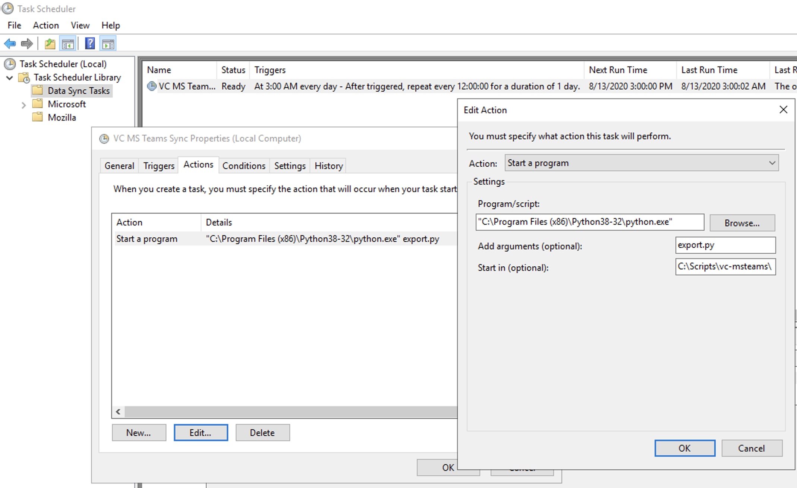

# vc-msteams
This is a python script for automating export of Veracross SIS data to a format that can be uploaded 
to Microsoft SDS.  Microsoft SDS will create Teams and Exchange Groups for classes in your SIS.

Microsoft SDS can be found at http://sds.microsoft.com

There is some light setup involved.  This is designed to run on Windows since the SDS Toolkit runs
on Windows.

### Step 1
Setup a Windows computer:
* Install Python for All Users
* Install SDS Toolkit from https://docs.microsoft.com/en-us/schooldatasync/install-the-school-data-sync-toolkit#BK_Install
* Install AzCopy 8.1 from https://aka.ms/downloadazcopy
* Make sure you can run PowerShell Scripts by executing this command in PS: Set-ExecutionPolicy RemoteSigned

### Step 2
Clone this repo to C:\Scripts\vc-msteams

Edit config.py to match your needs.

Edit sds_sync.ps1 to match your setup in SDS.

### Step 3
Store the credentials for the SDS admin that will run this on your Windows computer. Do this step as the windows user that 
will run the export.py so that credentials are stored in their keystore.

You will need to use the Add-CsvFileSyncTask command to store the credentials.  Once they are stored
you will want to delete the scheduled task.  We will only upload the csv files if there
is a change.  There is no need to upload every night if nothing has changed.

(https://docs.microsoft.com/en-us/schooldatasync/install-the-school-data-sync-toolkit#BK_ConfigureAutomated)

Add-CsvFileSyncTask -CSVFolderPath C:\Scripts\vc-msteams\csv -ProfileName CSV -LogPath C:\Logs\vc-msteams -UserName user@domain.org -StoreCredentials

### Step 4
Create a scheduled task in Windows to Run python export.py at your own frequency.
